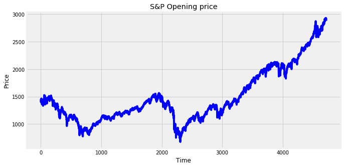

# Predicting S&P500 closing prices using a Recurrent neural network. 

## Data
The data for this is obtained from Yahoo. These can be downloaded from [here](https://finance.yahoo.com/quote/%5EGSPC/history?p=%5EGSPC).  A look at the closing prices. 

___

We use an LSTM model to forecast the closing prices of S&P. Predictions after 100 iterations;

The full notebook is [here](S&P_LSTM_forecast.ipynb). 

_Note: This is a draft version to check the general working of the LSTM network. A more concrete and complete code will be published soon._

