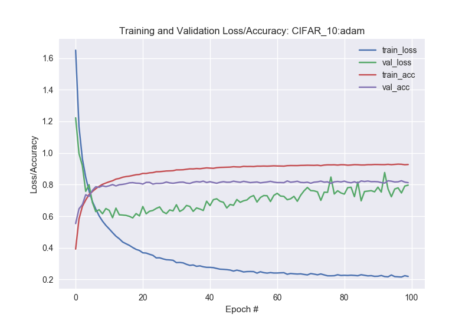
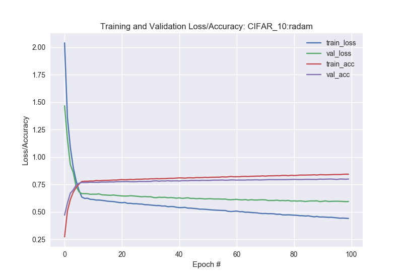

# R-Adam
**Tensoflow 2** implmentations of of the comparison between R-Adam and Adam.  
[Cross posted: R-Adam vs ADAM](https://venkat-rajgopal.github.io/Rectified-ADAM-optimizer/) 

`python3` usage: 
```
python3 train_cfar.py --optimizer adam --nepochs 100 --plot adam.png 
python3 train_cfar.py --optimizer radam --nepochs 100 --plot radam.png 
```

## Results





